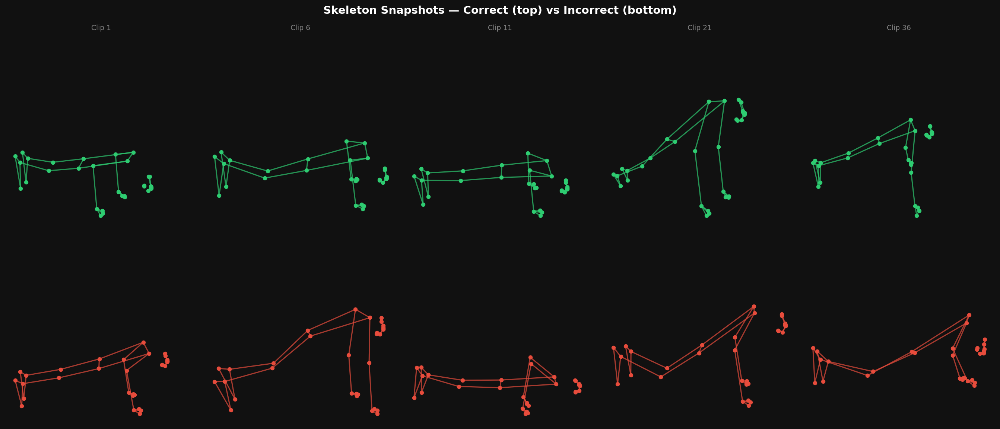
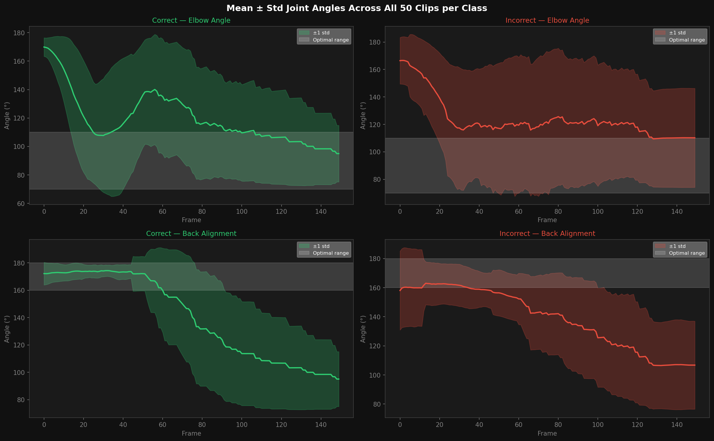
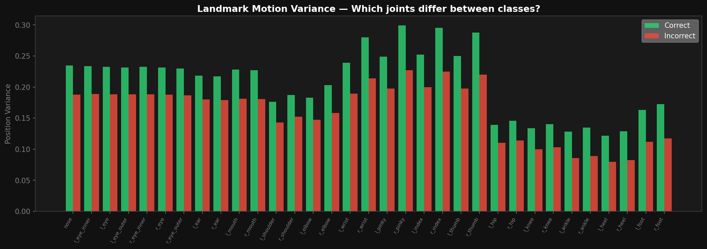
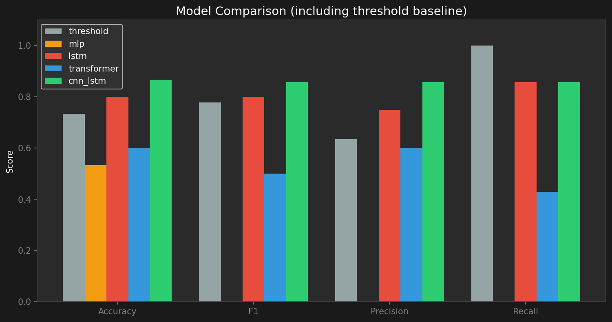

# Can AI Tell if Your Pushup Form is Wrong?

*We built a system that watches you do pushups and rates your form — here's what we learned.*

---

## The Problem

Bad pushup form is incredibly common and surprisingly hard to self-correct. Most people can feel when something is off, but without a mirror or a trainer watching, it's difficult to know *what* exactly is wrong — are your hips sagging? Are you not going low enough? Is your back rounding?

Personal trainers solve this by watching you move and giving real-time feedback. We asked: can a neural network learn to do the same thing from video?

---

## The Idea

The core approach is straightforward:

1. Watch a pushup video frame by frame
2. Track where each body joint is in every frame (shoulders, elbows, wrists, hips, ankles, etc.)
3. Feed that sequence of joint positions into a model that learned what correct form looks like
4. Get a verdict: **Good Form** or **Poor Form**

The interesting part isn't the verdict itself — it's that the model operates on *movement over time*, not just a single frame. A correct pushup has a specific rhythm: arms extend, body descends in a controlled straight line, elbows bend to ~90°, then push back up. Bad form looks different not just at the bottom but in *how you get there and back*.

---

## The Data

We used a dataset of **100 pushup video clips** — 50 with correct form and 50 with incorrect form — sourced from Kaggle.

Rather than processing raw video in the neural network (which would be expensive and hard to generalise), we first extracted body joint positions using **MediaPipe BlazePose**, a pose estimation model from Google. It identifies 33 body landmarks in each frame:


*Skeleton snapshots at the midpoint of the rep. Correct form (green, top) shows a consistent, flat body line. Incorrect form (red, bottom) shows more chaotic positions — hips high, arms at odd angles.*

For each video, we extracted 150 frames (5 seconds at 30fps), giving us 33 landmarks × 2 coordinates (x, y) = **66 numbers per frame**, and **150 frames per clip**. That's a sequence of shape (150, 66) for each video.

Before training, we normalised every sequence: we shifted the hip midpoint to the origin and scaled everything by torso height, so the model doesn't get confused by where in the frame someone is standing or how tall they are.

---

## What Does Good vs Bad Form Look Like in the Data?

The most revealing view is the joint angle over time. We track two key angles:

- **Elbow angle** (shoulder → elbow → wrist): should dip to 70–110° at the bottom of the rep
- **Back alignment** (shoulder → hip → ankle): should stay near 180° — a straight plank — throughout


*Mean ± standard deviation of joint angles across all 50 clips per class. Green = correct, Red = incorrect. The grey band marks the optimal angle range.*

A few things jump out immediately:

- **Correct form** (green) starts near 180° (arms extended), dips into the elbow target zone at the bottom, then comes back up. The band is relatively tight — correct-form clips look similar to each other.
- **Incorrect form** (red) has a much wider band, especially for back alignment. Bad form comes in many varieties, and the model needs to learn all of them.
- Both classes actually look similar on the elbow angle — the bigger discriminator is **back alignment**, which consistently stays above 160° for correct form but dips much lower for incorrect.

We can also see which joints vary the most between the two classes:


*Position variance per body landmark for correct (green) vs incorrect (red). Taller green bars mean that joint moves more in correct-form clips.*

Correct-form clips show higher variance almost everywhere — meaning good form involves more purposeful, full-range movement. Incorrect form is, in a sense, more static: less depth, less full extension.

---

## The Models

We tested four different neural network architectures, ranging from very simple to fairly complex, and compared them all against a simple geometric threshold.

**The threshold baseline** — no machine learning at all. One single rule: if the mean back alignment angle during the bottom phase of the rep is **≥ 160°**, it's good form. That's it. No training, no parameters, just geometry. This is the "just measure the angles" approach and sets the floor that any real model needs to beat.

**MLP (Multi-Layer Perceptron)** — the simplest neural network. It collapses all 150 frames into a single average and feeds that into a stack of fully-connected layers. The catch: it throws away all information about *how you moved* and only sees the average pose.

**LSTM (Long Short-Term Memory)** — reads the 150 frames one by one in sequence, maintaining a memory of what came before. This is the classic approach for anything with a time dimension — speech, video, motion. It sees both directions (forward and backward through the rep) and uses those hidden states to classify.

**CNN + LSTM** — adds a convolutional layer before the LSTM. The 1D convolution acts like a local pattern detector, finding short-window features (e.g., "elbow bent for 5 frames") before the LSTM reads the bigger-picture sequence.

**Transformer** — uses self-attention to look at all 150 frames simultaneously and decide which frames matter most for classification. A learnable "classification token" aggregates information from the full sequence.

---

## Results


*Accuracy, F1-score, precision, and recall for all five approaches. Higher is better.*

| Model | Accuracy | F1 Score |
|-------|----------|----------|
| Threshold baseline | 73.3% | 0.78 |
| MLP | 53.3% | 0.00 |
| LSTM | 80.0% | 0.80 |
| Transformer | 60.0% | 0.50 |
| **CNN + LSTM** | **86.7%** | **0.86** |

A few interesting results:

**CNN + LSTM wins** at 86.7% accuracy and 0.857 F1-score, beating even the threshold baseline by 13 percentage points. Combining local pattern detection with sequence memory turned out to be the right inductive bias for this problem.

**The threshold baseline is surprisingly strong** — a single number (160°) gets you 73.3% accuracy with perfect recall, meaning it never misses a correctly-done pushup. The tradeoff is low precision: it's too generous, approving some incorrect-form clips because bad-form reps can also briefly hit 160° back alignment. The geometric signal is real, but one number can only do so much.

**MLP completely fails** — it predicts everything as one class, getting 53% accuracy but 0.0 F1. This confirms that form is not in the average pose, but in the *movement*. Squishing 150 frames into one loses all the information the model needs.

**The Transformer underperforms** given the small dataset size. Transformers excel with large amounts of data; with only 70 training clips, there isn't enough signal for self-attention to learn meaningful patterns without overfitting.

---

## How it Works in Practice

Once trained, you can run the model on any pushup video:

```
Prediction : Good Form
Confidence : 85.7%

Coaching feedback:
  • Hips sagging — keep your back straight (142°). Target 160–180°.
```

The coaching feedback comes from a separate rule-based layer that checks specific joint angles and translates them into plain English — the neural network makes the call, the geometry explains *why*.

You can also run it live via webcam, where the skeleton overlay and form label update in real time as you do the movement.

---

## What We Learned

**Temporal models clearly beat static ones.** The MLP's failure is a clean proof that pushup form lives in the motion, not the snapshot.

**Small datasets hurt complex models.** The Transformer, which is state-of-the-art for sequence modelling, loses to a much simpler CNN+LSTM because 100 clips aren't enough to train attention patterns. With more data, that ranking might flip.

**Back alignment is the strongest signal.** Elbow depth barely differs between classes (129° vs 132° on average), but back alignment separates them clearly. This matches what coaches actually look for — "keep your hips down" is the most common pushup cue for a reason.

**A geometric baseline is a good sanity check.** Starting with the simple threshold told us what the model *needs to beat* and gave us a floor for expectations. The CNN+LSTM does beat it meaningfully, validating that the temporal model is learning something real.

---

## Conclusion

We built a system that classifies pushup form from video with 86.7% accuracy using a CNN+LSTM architecture trained on 33 body joint positions across 150 frames per rep. The model outperforms both a geometric threshold and simpler neural networks, and produces interpretable coaching feedback on top of its binary verdict.

The full code, trained models, and dataset are available at the GitHub link below. The entire pipeline — from raw video to real-time webcam feedback — runs on a standard laptop with no GPU required.

**GitHub:** [https://github.com/josephho9/ANN_Final_Project](https://github.com/josephho9/ANN_Final_Project)  
**Dataset:** [Kaggle — Push-up Exercise Dataset](https://www.kaggle.com/datasets/mohamedhanyyy/push-up-exercise-dataset)
